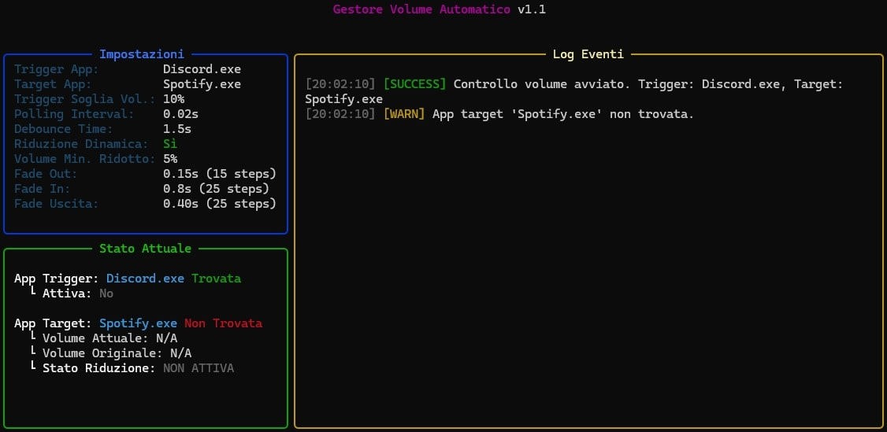

# Automatic Volume Manager


Un'utility Python per Windows che gestisce automaticamente il volume di un'applicazione target in base all'attività audio di un'applicazione trigger. Utilizza una TUI (Text User Interface) basata su Rich per visualizzare lo stato e i log in tempo reale.


## Caratteristiche Principali

*   **Monitoraggio App Trigger:** Rileva quando un'applicazione specificata (es. Discord, Teams) sta emettendo audio sopra una soglia definita.
*   **Controllo App Target:** Abbassa il volume di un'altra applicazione (es. Spotify, un gioco) quando l'app trigger è attiva.
*   **Ripristino Automatico:** Ripristina il volume originale dell'app target quando l'app trigger diventa silenziosa (dopo un periodo di debounce).
*   **Riduzione Volume Configurabile:**
    *   **Fissa:** Abbassa il volume di una percentuale fissa.
    *   **Dinamica:** Abbassa il volume in base a regole definite (es. più alto è il volume originale, maggiore è la riduzione).
*   **Fading del Volume:** Transizioni graduali del volume (fade-in/fade-out) per un'esperienza più fluida.
*   **TUI:** Interfaccia utente nel terminale che mostra:
    *   Impostazioni correnti.
    *   Stato delle applicazioni trigger e target (trovate, attive).
    *   Volume corrente e originale dell'app target.
    *   Log degli eventi in tempo reale.
*   **Configurazione Flessibile:** Tutte le impostazioni sono gestite tramite un file `config.ini`.
*   **Ripristino all'Uscita:** Tenta di ripristinare il volume originale dell'app target quando lo script viene chiuso (Ctrl+C).


## Come Funziona

Lo script esegue il polling delle sessioni audio attive su Windows a intervalli regolari:
1.  Identifica le sessioni audio per l'applicazione "trigger" e "target" specificate nel `config.ini`.
2.  Misura il livello di picco dell'audio dell'applicazione trigger.
3.  Se il picco supera la `TriggerVolumeThreshold`:
    *   Se l'applicazione target non è già stata "ridotta", ne memorizza il volume attuale come "originale".
    *   Calcola il nuovo volume target ridotto (fisso o dinamico).
    *   Abbassa gradualmente (fade-out) il volume dell'applicazione target al livello ridotto.
    *   Mantiene il volume ridotto finché l'applicazione trigger è attiva.
4.  Se l'applicazione trigger scende sotto la soglia:
    *   Attende per un `DebounceTimeSeconds` per evitare fluttuazioni rapide.
    *   Se l'applicazione trigger rimane silenziosa, ripristina gradualmente (fade-in) il volume dell'applicazione target al suo livello "originale".
5.  Se il volume dell'app target viene modificato manualmente mentre è in stato "ridotto", lo script lo riporterà al livello ridotto previsto.
6.  All'uscita (Ctrl+C), lo script tenta di ripristinare il volume dell'app target al suo valore originale se era stato ridotto.

## Requisiti

### Per eseguire lo script Python:
*   Windows (testato su Windows 11, python 3.10.6)
*   Python 3.7+
*   Pip (Python package installer)
*   Le librerie Python elencate in `requirements.txt`:
    *   `pycaw`: Per il controllo del volume audio per-applicazione.
    *   `psutil`: Per ottenere i nomi dei processi dagli ID.
    *   `rich`: Per la TUI avanzata.
    *   `comtypes`: Dipendenza di `pycaw`.

## Installazione e Utilizzo

### Opzione 1: Utilizzare lo script Python

1.  **Clona il repository o scarica i file:**
    ```bash
    git clone https://github.com/morelli03/volume-changer.git
    cd volume-changer
    ```
    Oppure scarica lo ZIP ed estrailo.

3.  **Installa le dipendenze:**
    ```bash
    pip install -r requirements.txt
    ```

4.  **Configura `config.ini`:**
    *   Apri `config.ini` con un editor di testo e modifica i valori secondo le tue esigenze (vedi la sezione "Configurazione" sotto). **Assicurati che i nomi delle applicazioni (`TriggerAppName`, `TargetAppName`) corrispondano esattamente ai nomi dei processi eseguibili (es. `Discord.exe`, `Spotify.exe`).**

5.  **Esegui lo script:**
    ```bash
    python volume_manager_1.1.py
    ```

6.  **Per uscire:** Premi `Ctrl+C` nella finestra del terminale dove lo script è in esecuzione.

### Opzione 2: Utilizzare il file `.exe` precompilato

1.  **Scarica il file `vc_setup.exe`** dalla sezione [**Releases**](https://github.com/morelli03/volume-changer/releases/) di questo repository.
2.  **Esegui `vc_setup.exe`**. Installa il programma. 
**Per uscire:** Premi `Ctrl+C` nella finestra del terminale o chiudi la finestra.

    **Nota:** Alcuni software antivirus potrebbero segnalare il file `.exe` come potenziale minaccia (falso positivo) perché non è firmato digitalmente.

## Configurazione (`config.ini`)

Il file `config.ini` permette di personalizzare il comportamento dello script. Assicurati che i nomi delle applicazioni siano i nomi dei file eseguibili (es. `firefox.exe`, non "Firefox").

```ini
[General]
; Nome dell'eseguibile dell'applicazione che, quando attiva, farà abbassare il volume dell'app target
; Esempi: discord.exe, msteams.exe, zoom.exe
TriggerAppName = discord.exe

; Nome dell'eseguibile dell'applicazione il cui volume verrà controllato
; Esempi: spotify.exe, vlc.exe, chrome.exe (se vuoi abbassare il browser per i giochi)
TargetAppName = spotify.exe

; Intervallo in secondi tra i controlli del volume
PollingIntervalSeconds = 0.5

; Tempo in secondi che l'app trigger deve rimanere silenziosa prima di ripristinare il volume dell'app target
DebounceTimeSeconds = 2.0

[VolumeControl]
; Soglia di volume (da 0.0 a 1.0) dell'app trigger per considerarla "attiva"
; 0.1 = 10% di picco audio
TriggerVolumeThreshold = 0.05

; Se True, usa le regole dinamiche. Se False, usa FixedReductionAmountPoints.
UseDynamicReduction = True

; Valore fisso (da 0.0 a 1.0) di cui ridurre il volume dell'app target
; Es: 0.3 = riduce il volume di 30 punti percentuali (es. da 70% a 40%)
; Usato solo se UseDynamicReduction = False
FixedReductionAmountPoints = 0.30

; Volume minimo (da 0.0 a 1.0) a cui l'app target può essere ridotta
; Es: 0.05 = il volume non scenderà mai sotto il 5%
MinimumVolumeAfterReduction = 0.05

; Tolleranza per confronti tra valori di volume float (evita aggiustamenti per differenze minime)
VolumeFloatTolerance = 0.001

[DynamicReductionRules]
; Usato solo se UseDynamicReduction è True.
; Formato: "livello_soglia_originale:ammontare_riduzione, ..."
; - livello_soglia_originale: Se il volume originale del target è >= a questo valore, la regola si applica.
; - ammontare_riduzione: Valore da sottrarre al volume originale (es. 0.80 per ridurre di 80 punti percentuali).
; Le regole vengono valutate nell'ordine in cui sono scritte. La PRIMA regola che corrisponde viene utilizzata.
; Quindi, elenca le regole con soglie più alte per prime.
; Il volume finale sarà sempre limitato da MinimumVolumeAfterReduction (sezione VolumeControl).
;
; La regola '0.10001:0.10' è pensata per volumi originali appena sopra (MinimumVolumeAfterReduction + 0.05). Se MinimumVolumeAfterReduction è 0.05, allora 0.05 + 0.05 = 0.10. La soglia 0.10001 cattura i volumi > 0.10.
; La regola '0.0:0.05' è un fallback per volumi molto bassi, se nessuna regola precedente corrisponde.
Rules = 0.95:0.80, 0.85:0.65, 0.75:0.45, 0.50:0.35, 0.25:0.15, 0.10001:0.10, 0.0:0.05

[Fading]
; Durata in secondi per l'effetto di fade-out (abbassamento volume)
FadeOutDurationSeconds = 0.3
; Numero di step per il fade-out
FadeOutSteps = 10

; Durata in secondi per l'effetto di fade-in (ripristino volume)
FadeInDurationSeconds = 0.5
; Numero di step per il fade-in
FadeInSteps = 15

; Durata in secondi per l'effetto di fade-in quando si esce dallo script (Ctrl+C)
; Se <=0, usa metà della FadeInDurationSeconds
ExitFadeDurationSeconds = 0.0 ; Usare 0.0 per il fallback automatico, oppure un valore tipo 0.1
; Numero di step per il fade-in all'uscita
; Se <=0, usa FadeInSteps
ExitFadeSteps = 0 ; Usare 0 per il fallback automatico, oppure un valore tipo 5

[TUI]
; Quante volte al secondo aggiornare l'interfaccia utente (TUI)
RefreshRate = 4
; Numero massimo di messaggi da conservare e visualizzare nel log della TUI
MaxLogMessages = 100
```

## Troubleshooting

*   **Applicazione Trigger/Target non trovata:**
    *   Assicurati che il nome dell'applicazione in `config.ini` (`TriggerAppName`, `TargetAppName`) corrisponda **esattamente** al nome del processo eseguibile (es. `Spotify.exe`, non "Spotify Music"). Puoi trovare i nomi dei processi nel Task Manager (scheda Dettagli).
    *   Assicurati che le applicazioni siano in esecuzione e stiano producendo/ricevendo audio.
*   **Il volume non cambia:**
    *   Verifica `TriggerVolumeThreshold`. Se è troppo alto, l'app trigger potrebbe non essere mai considerata "attiva". Se troppo basso, potrebbe essere sempre attiva.
    *   Controlla i log nella TUI per messaggi di errore o informazioni sullo stato.
*   **Errore "File 'config.ini' non trovato":**
    *   Assicurati che `config.ini` esista e sia nella stessa directory dello script Python o del file `.exe`.
*   **Permessi:** In rari casi, potrebbero essere necessari permessi di amministratore se le applicazioni target sono eseguite come amministratore, ma generalmente non è richiesto.

## Contribuire
I contributi sono benvenuti! Sentiti libero di aprire una issue per segnalare bug o suggerire miglioramenti, o un pull request con le tue modifiche.

## Licenza
Questo progetto è rilasciato sotto la Licenza GPLv3. Vedi il file `LICENSE` per maggiori dettagli.
